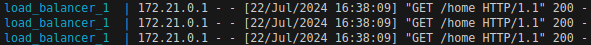
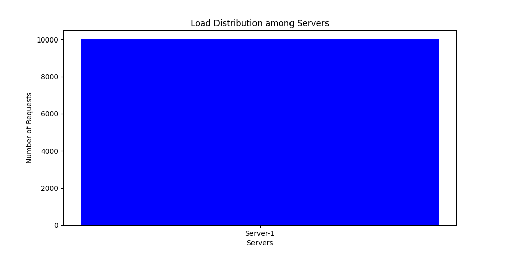
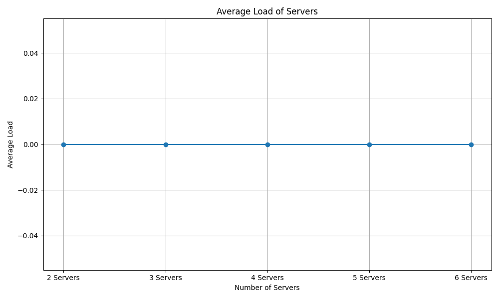

# Customizable Load Balancer

## Group Members
1. Ruman Hassan
2. Charles Owako
3. Cynthia Chemutai
4. Joyline Karanja

## Overview

This project implements a customizable load balancer using consistent hashing. The load balancer distributes client requests among several server replicas to evenly distribute the load.

## Prerequisites
- Docker
- Docker Compose
- Python 3.x
- Required Python packages (listed in requirements.txt or installed directly within the Docker containers)

## Building and Running the Project
1. Clone the Repository

   ```sh 
   git clone git@github.com:jKaranja19/load_balancer.git 
   ```

2. Build and Start the Containers

   ```sh
    docker-compose up --build
    ```

- This command will build the Docker images for the load balancer and the servers, and start the containers.

## Running Performance Analysis
1. Open a new terminal window:
- Open a new terminal or split your current terminal.
- Navigate to the project directory: 
   ``` cd /load_balancer/load_balancer_project/my_load_balancer ```
2. Run the performance analysis script:
   ``` python3 performance_analysis.py ```
- This script will send requests to the load balancer and collect performance data. It will then generate visualizations (bar graphs and line charts) and save them in the project directory.


## Project Analysis
The performance analysis is a crucial part of this project, providing insights into the efficiency and behavior of the load balancer under different conditions. The analysis is divided into four main parts: A-1 to A-4.

### A-1: Response Time Collection
- In this part, we measure the response times of requests processed by the load balancer. The performance_analysis.py script sends a series of HTTP requests to the load balancer and records the time taken for each request to receive a response. The collected data includes:
   - Timestamp: When the request was sent.
   - Response Time: Time taken to receive a response.
   - Server Response: Which server responded to the request.
- This data provides a detailed view of how quickly the load balancer and backend servers handle incoming requests.


### A-2: Data Visualization - Response Time Bar Graphs
- Using the collected response time data, the script generates bar graphs to visualize the response times of individual requests. Each bar represents the response time for a single request, making it easy to see the distribution and variability of response times.
- Key insights from the bar graphs include:
   - Response Time Distribution: Identifying patterns or anomalies in the response times.
   - Performance Outliers: Spotting requests that took significantly longer to process, which may indicate bottlenecks or issues with specific servers.


### A-3: Data Visualization - Load Distribution Line Charts
- In addition to response times, the analysis also looks at how the load is distributed among the backend servers. The script generates line charts showing the number of requests handled by each server over time. Each line represents a different server.
- Key insights from the line charts include:
   - Load Balancing Efficiency: Determining if the load balancer distributes requests evenly across servers.
   - Server Utilization Patterns: Identifying if any server is underutilized or overloaded.



### A-4: Comprehensive Analysis and Interpretation
- Combining the insights from the response time bar graphs and load distribution line charts, we perform a comprehensive analysis to understand the overall performance and efficiency of the load balancer. This includes:
   - Identifying Bottlenecks: Analyzing response times to pinpoint slow responses and their causes.
   - Evaluating Load Balancer Algorithm: Assessing how well the load balancing algorithm distributes the load.
   - Server Performance: Comparing the performance of individual servers to identify any that are underperforming.

## Troubleshooting
### Common Issues
1. Port conflicts: Ensure no other services are running on the same ports used by the Docker containers.
2. Docker daemon not running: Make sure Docker is installed and running on your system.
3. dependency issues: Ensure all required Python packages are installed within the Docker containers.

### Solutions
- Check running services: 
   - Use docker ps to see if any containers are already using the required ports.
- Restart Docker: Sometimes, restarting the Docker daemon can resolve connectivity issues.